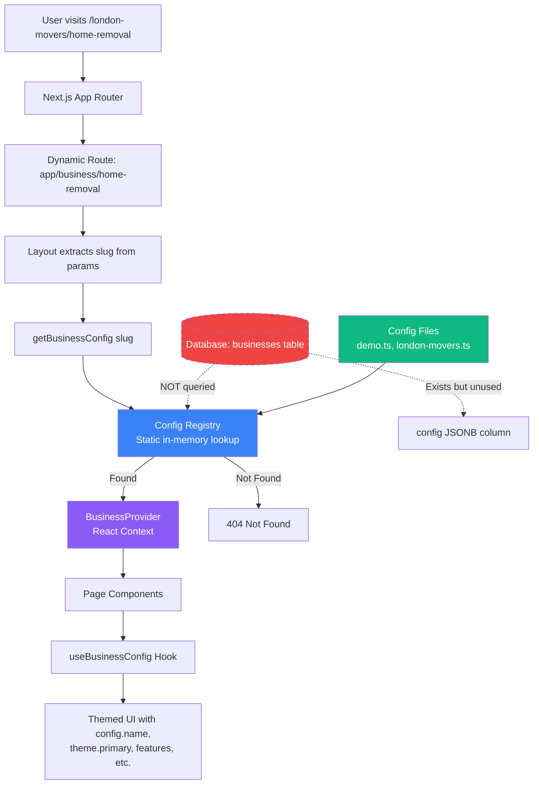
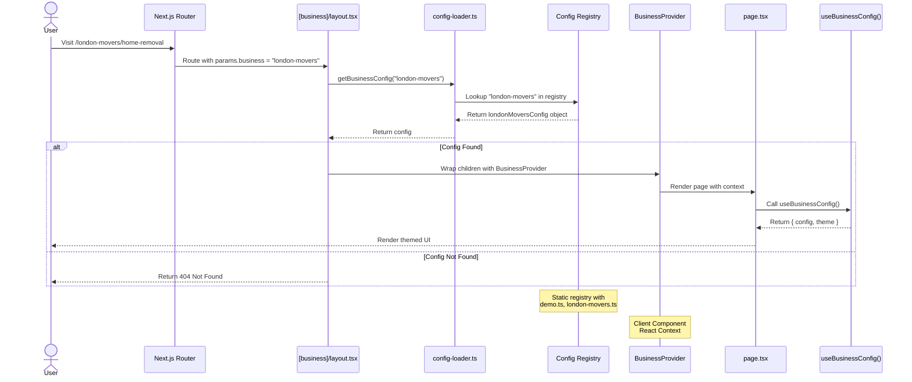
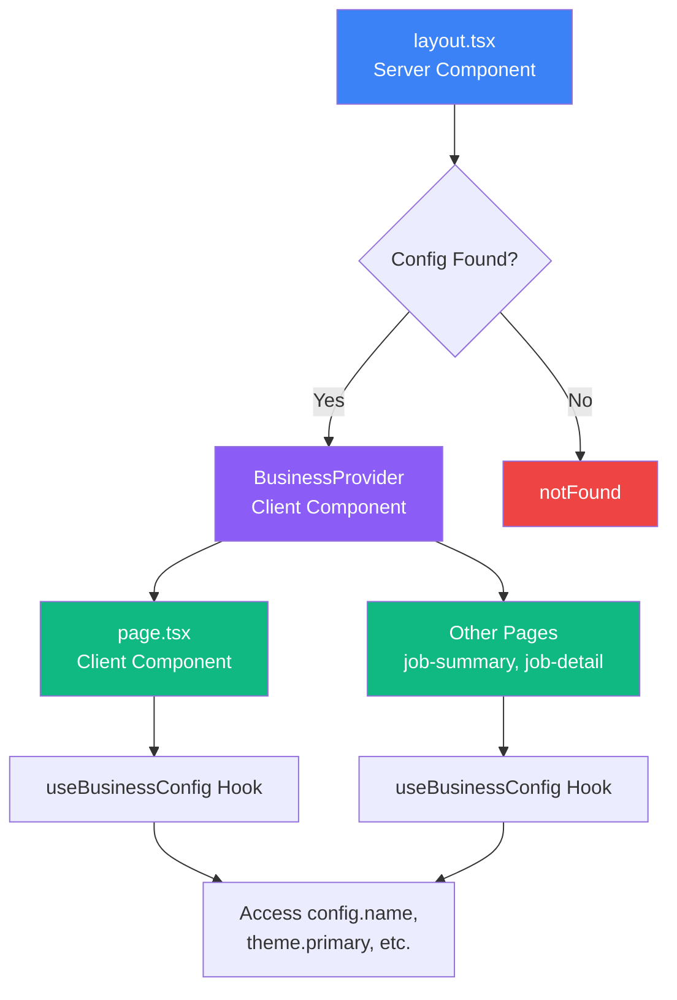
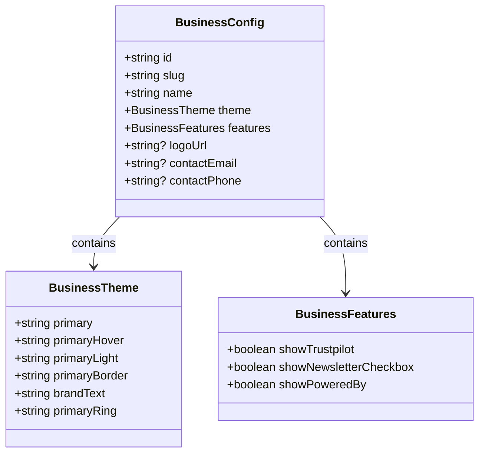
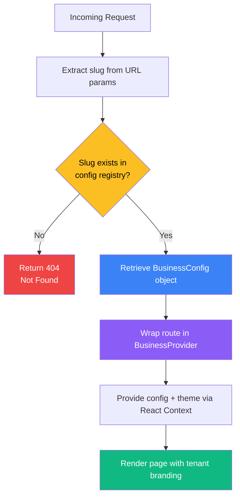
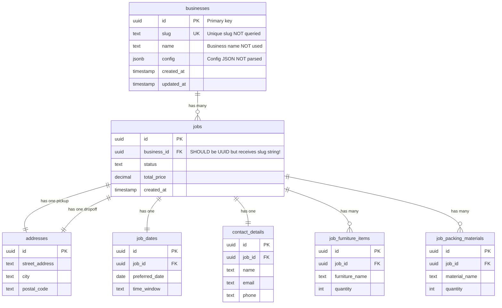
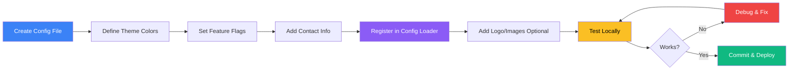
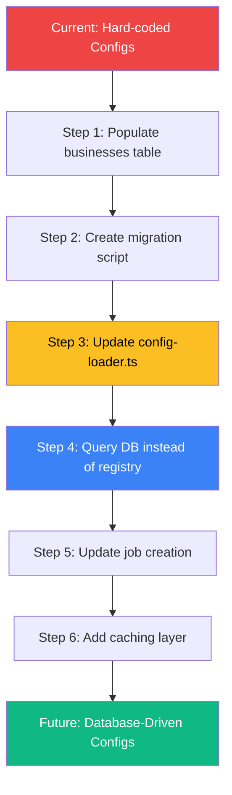

# Business Configs & Tenant Scaling Guide

## Short Answer: Is `config-loader.ts` Reading From the `businesses` Table?
No. The config registry in `src/lib/business/config-loader.ts` is **static** and loaded from local TypeScript files (e.g. `src/lib/business/configs/demo.ts`). It **does not** read from the `businesses` table defined in `database/datamodels/02_tables.sql`.

The database table exists and includes a `config` JSONB column, but there is no code path that currently queries it.

For a visual overview of how the system works, see the [Visual Architecture Overview](#visual-architecture-overview) section below.

## Visual Architecture Overview

The multi-tenant system uses a layered architecture with hard-coded configuration files, Next.js dynamic routing, and React Context for theme/config distribution:



**Key Components:**
- **Config Files** (green): Hard-coded TypeScript files in `src/lib/business/configs/`
- **Config Registry** (blue): In-memory lookup in `config-loader.ts`
- **BusinessProvider** (purple): React Context that distributes config/theme to components
- **Database** (red, dashed): Exists but is **not currently used** for configuration

## Current Multi‑Tenant Flow (Slug → Config → UI)

### 1) Route slug drives tenant selection
- The App Router uses a dynamic segment: `src/app/[business]/home-removal/`.
- The URL slug (e.g. `/demo/home-removal`) is read from `params.business`.

### 2) Config lookup is in-memory
- `src/lib/business/config-loader.ts` holds a registry keyed by slug:
  - `demo`
  - `london-movers`
- `getBusinessConfig(slug)` returns the matching config object (or `null`).

### 3) Layout validates and provides the config
- `src/app/[business]/home-removal/layout.tsx` calls `getBusinessConfig`.
- If not found, it triggers `notFound()`.
- On success, it wraps the route in `BusinessProvider`, exposing config/theme via React context.

### 4) Pages consume theme + config
- Pages like `src/app/[business]/home-removal/page.tsx`, `job-summary`, and `job-detail` use `useBusinessConfig()` to access:
  - `config` (name, slug, features, contact info)
  - `theme` (colors)
- `src/lib/business/useTheme.ts` provides default theme values if no provider is present.

### Request Flow Sequence

This diagram shows the complete lifecycle of a tenant-specific request:



### Component Context Hierarchy

The React component tree shows how configuration flows from server to client:



## Where Business Configs Live Today
- `src/lib/business/configs/demo.ts`
- `src/lib/business/configs/london-movers.ts`
- Registry and lookup in `src/lib/business/config-loader.ts`

`BusinessConfig` shape is defined in `src/lib/business/types.ts` and includes:
- `id`, `slug`, `name`
- `theme` (color tokens)
- `features` (feature flags)
- optional `logoUrl`, `contactEmail`, `contactPhone`

## Type System Overview

The configuration system is built on TypeScript interfaces that define theme colors, feature flags, and tenant metadata:



### Example Configuration

Here's how a real tenant config looks:

```typescript
// src/lib/business/configs/london-movers.ts
import { BusinessConfig } from '../types';

export const londonMoversConfig: BusinessConfig = {
  id: 'london-movers',
  slug: 'london-movers',
  name: 'London Movers',
  theme: {
    primary: '#2563eb',      // blue-600
    primaryHover: '#1d4ed8', // blue-700
    primaryLight: '#eff6ff', // blue-50
    primaryBorder: '#93c5fd', // blue-300
    brandText: '#7c3aed',    // violet-600
    primaryRing: '#bfdbfe',  // blue-200
  },
  features: {
    showTrustpilot: true,
    showNewsletterCheckbox: true,
    showPoweredBy: true,
  },
  contactEmail: 'info@london-movers.example.com',
  contactPhone: '+44 20 1234 5678',
};
```

## How Different Slugs Scale Tenants Today
The system scales tenants by:
1. **Adding a new config file** for a tenant
2. **Registering it in the config registry**
3. **Serving a tenant-specific URL** via the slug

Example:
- Add `src/lib/business/configs/acme-removals.ts`
- Register in `config-loader.ts` under `acme-removals`
- The route `/acme-removals/home-removal` now resolves to that config

This is simple and predictable, but it is **code‑driven** and requires a deploy for each new tenant.

### Configuration Loading Decision Flow



## Database Table vs. Current Runtime
The database defines this table:
- `businesses (id uuid, slug text, name text, config jsonb, ...)`

But the current UI config system:
- does **not** query the `businesses` table
- does **not** parse the `config` JSON
- uses **hardcoded configs** in code instead

### Database Schema Relationships



**Critical Issue:** The `businesses` table is defined in the schema but:
- **Not queried** by `config-loader.ts`
- **Not used** for tenant configuration
- `jobs.business_id` column expects a UUID but receives a slug string (see below)

## Known Issue: `business_id` Type Mismatch

### The Problem
The `jobs.business_id` column is defined as a UUID foreign key referencing `businesses.id` in the schema:

```sql
-- From database/datamodels/02_tables.sql
CREATE TABLE jobs (
    id UUID PRIMARY KEY DEFAULT gen_random_uuid(),
    business_id UUID REFERENCES businesses(id),
    -- ... other columns
);
```

However, the current UI code passes **`config.slug`** (a string) into `createJobAction` as `businessId`:

```typescript
// From src/app/[business]/home-removal/page.tsx
const jobData = {
  businessId: config.slug !== 'demo' ? config.slug : null,
  // ... other fields
};

await createJobAction(jobData);
```

### The Impact
- `jobs.business_id` stores a slug string (e.g., `"london-movers"`) or `null`
- This **does not match** the intended UUID foreign key constraint
- Database joins between `jobs` and `businesses` tables will fail
- Referential integrity is compromised

### Recommended Fixes

**Option A: Change Schema to Accept Slug**
```sql
ALTER TABLE jobs
ALTER COLUMN business_id TYPE VARCHAR(255);

-- Add index for lookups
CREATE INDEX idx_jobs_business_slug ON jobs(business_id);
```

**Option B: Use Database UUIDs in Application**
1. Query `businesses` table to get UUID by slug
2. Pass UUID to `createJobAction` instead of slug
3. Requires actually populating the `businesses` table with tenant data

**Option C: Create Mapping Table**
```sql
CREATE TABLE business_slug_map (
    slug VARCHAR(255) PRIMARY KEY,
    business_id UUID REFERENCES businesses(id)
);
```

**Recommended:** Use **Option A** if staying with code-based configs, or **Option B** if migrating to database-driven configs.

## Recommended Paths for Scaling

### Option A: Keep Code‑Based Configs (Current Model)
- Fast and simple for a small number of tenants
- Requires code changes + redeploys
- Good for tightly controlled onboarding

### Option B: Load Configs From the DB (Future‑Friendly)
- Store tenant config JSON in `businesses.config`
- Query by slug at request time (server‑side)
- Hydrate `BusinessProvider` with DB values
- Enables non‑code tenant onboarding

## Quick Checklist for Adding a New Tenant (Current Model)

### Step-by-Step Process



### Detailed Steps

#### 1. Create Config File
Create a new file: `src/lib/business/configs/acme-removals.ts`

```typescript
import { BusinessConfig } from '../types';

export const acmeRemovalsConfig: BusinessConfig = {
  id: 'acme-removals',
  slug: 'acme-removals',
  name: 'Acme Removals',
  theme: {
    primary: '#10b981',      // green-500
    primaryHover: '#059669', // green-600
    primaryLight: '#ecfdf5', // green-50
    primaryBorder: '#6ee7b7', // green-300
    brandText: '#10b981',    // green-500
    primaryRing: '#a7f3d0',  // green-200
  },
  features: {
    showTrustpilot: true,
    showNewsletterCheckbox: false,
    showPoweredBy: false,
  },
  contactEmail: 'bookings@acme-removals.com',
  contactPhone: '+44 20 9876 5432',
};
```

#### 2. Register in Config Loader
Edit `src/lib/business/config-loader.ts`:

```typescript
import { demoConfig } from './configs/demo';
import { londonMoversConfig } from './configs/london-movers';
import { acmeRemovalsConfig } from './configs/acme-removals'; // Add import

const configRegistry: Record<string, BusinessConfig> = {
  demo: demoConfig,
  'london-movers': londonMoversConfig,
  'acme-removals': acmeRemovalsConfig, // Add to registry
};
```

#### 3. Add Logo (Optional)
Place logo in `public/images/acme-removals-logo.png` and update config:

```typescript
export const acmeRemovalsConfig: BusinessConfig = {
  // ... other properties
  logoUrl: '/images/acme-removals-logo.png',
};
```

#### 4. Test Locally
```bash
npm run dev
```

Visit: `http://localhost:3000/acme-removals/home-removal`

#### 5. Verify Theme Application
Check that your theme colors appear correctly:
- Buttons should use `theme.primary` for background
- Hover states should use `theme.primaryHover`
- Brand name should use `theme.brandText`

### Troubleshooting

**Issue:** 404 Not Found
- Check that slug in config matches slug in registry
- Ensure config is exported from the file
- Verify import statement in `config-loader.ts`

**Issue:** Theme not applying
- Confirm `BusinessProvider` is wrapping your page
- Check browser console for Context errors
- Verify `useBusinessConfig()` hook is called inside provider tree

**Issue:** Wrong colors showing
- Clear browser cache
- Check hex color values in theme object
- Ensure Tailwind config isn't overriding custom colors

### Checklist
- [ ] Create config file under `src/lib/business/configs/`
- [ ] Define all required theme colors
- [ ] Set feature flags appropriately
- [ ] Add contact information
- [ ] Register in `src/lib/business/config-loader.ts`
- [ ] Add logo/images (optional)
- [ ] Test at `/your-slug/home-removal`
- [ ] Verify theme colors display correctly
- [ ] Check feature flags work as expected
- [ ] Commit changes and deploy

## Common Use Cases

### Accessing Theme in Components

```typescript
'use client';

import { useBusinessConfig } from '@/lib/business/BusinessContext';

export default function BookingButton() {
  const { theme, config } = useBusinessConfig();

  return (
    <button
      style={{
        backgroundColor: theme.primary,
        color: '#ffffff',
      }}
      className="px-6 py-3 rounded-lg font-semibold transition-colors"
      onMouseEnter={(e) => {
        e.currentTarget.style.backgroundColor = theme.primaryHover;
      }}
      onMouseLeave={(e) => {
        e.currentTarget.style.backgroundColor = theme.primary;
      }}
    >
      Book with {config.name}
    </button>
  );
}
```

### Using Feature Flags

```typescript
'use client';

import { useBusinessConfig } from '@/lib/business/BusinessContext';

export default function BookingForm() {
  const { config } = useBusinessConfig();

  return (
    <form>
      {/* Form fields */}

      {config.features.showNewsletterCheckbox && (
        <label className="flex items-center gap-2">
          <input type="checkbox" name="newsletter" />
          <span>Subscribe to our newsletter</span>
        </label>
      )}

      {config.features.showTrustpilot && (
        <div className="trustpilot-widget">
          {/* Trustpilot widget code */}
        </div>
      )}

      <button type="submit">Submit Booking</button>

      {config.features.showPoweredBy && (
        <p className="text-sm text-gray-500 mt-4">
          Powered by EverReady AI
        </p>
      )}
    </form>
  );
}
```

### Displaying Contact Information

```typescript
'use client';

import { useBusinessConfig } from '@/lib/business/BusinessContext';

export default function ContactInfo() {
  const { config } = useBusinessConfig();

  return (
    <div className="space-y-2">
      <h3 className="font-semibold">Contact Us</h3>

      {config.contactEmail && (
        <p>
          <strong>Email:</strong>{' '}
          <a href={`mailto:${config.contactEmail}`}>
            {config.contactEmail}
          </a>
        </p>
      )}

      {config.contactPhone && (
        <p>
          <strong>Phone:</strong>{' '}
          <a href={`tel:${config.contactPhone}`}>
            {config.contactPhone}
          </a>
        </p>
      )}
    </div>
  );
}
```

### Using Theme with Tailwind Classes

While you can use inline styles with theme colors, you can also create dynamic Tailwind classes:

```typescript
'use client';

import { useBusinessConfig } from '@/lib/business/BusinessContext';

export default function ThemedCard() {
  const { theme } = useBusinessConfig();

  return (
    <div
      className="rounded-lg p-6 border"
      style={{
        borderColor: theme.primaryBorder,
        backgroundColor: theme.primaryLight,
      }}
    >
      <h2 style={{ color: theme.brandText }}>
        Welcome to Our Service
      </h2>
      <p className="text-gray-700 mt-2">
        Professional removal services tailored to your needs.
      </p>
    </div>
  );
}
```

### Accessing Config in Server Components

In Server Components (like layouts), you can directly import and call the config loader:

```typescript
import { getBusinessConfig } from '@/lib/business/config-loader';
import { notFound } from 'next/navigation';

export default async function BusinessLayout({
  params,
  children,
}: {
  params: { business: string };
  children: React.ReactNode;
}) {
  const config = getBusinessConfig(params.business);

  if (!config) {
    notFound();
  }

  return (
    <div>
      <header>
        <h1>{config.name}</h1>
        {config.logoUrl && (
          
        )}
      </header>
      <main>{children}</main>
    </div>
  );
}
```

## Future Migration Path: Database-Driven Configs

If you want to move from hard-coded configs to database-driven multi-tenancy, here's the migration path:

### Migration Overview



### Step 1: Populate the `businesses` Table

Insert existing tenants into the database:

```sql
-- Insert demo tenant
INSERT INTO businesses (id, slug, name, config, created_at, updated_at)
VALUES (
  gen_random_uuid(),
  'demo',
  'Demo Removals',
  '{
    "theme": {
      "primary": "#EAB308",
      "primaryHover": "#CA8A04",
      "primaryLight": "#FEF9C3",
      "primaryBorder": "#FDE047",
      "brandText": "#CA8A04",
      "primaryRing": "#FEF08A"
    },
    "features": {
      "showTrustpilot": false,
      "showNewsletterCheckbox": true,
      "showPoweredBy": true
    }
  }'::jsonb,
  NOW(),
  NOW()
);

-- Insert london-movers tenant
INSERT INTO businesses (id, slug, name, config, created_at, updated_at)
VALUES (
  gen_random_uuid(),
  'london-movers',
  'London Movers',
  '{
    "theme": {
      "primary": "#2563eb",
      "primaryHover": "#1d4ed8",
      "primaryLight": "#eff6ff",
      "primaryBorder": "#93c5fd",
      "brandText": "#7c3aed",
      "primaryRing": "#bfdbfe"
    },
    "features": {
      "showTrustpilot": true,
      "showNewsletterCheckbox": true,
      "showPoweredBy": true
    },
    "contactEmail": "info@london-movers.example.com",
    "contactPhone": "+44 20 1234 5678"
  }'::jsonb,
  NOW(),
  NOW()
);
```

### Step 2: Update `config-loader.ts` to Query Database

```typescript
// src/lib/business/config-loader.ts
import { createClient } from '@/lib/supabase';
import { BusinessConfig, BusinessTheme, BusinessFeatures } from './types';

// Cache configs in memory for performance
const configCache = new Map<string, BusinessConfig>();
const CACHE_TTL = 60 * 1000; // 1 minute
const cacheTimestamps = new Map<string, number>();

export async function getBusinessConfig(slug: string): Promise<BusinessConfig | null> {
  // Check cache first
  const cached = configCache.get(slug);
  const cacheTime = cacheTimestamps.get(slug);

  if (cached && cacheTime && Date.now() - cacheTime < CACHE_TTL) {
    return cached;
  }

  // Query database
  const supabase = createClient();
  const { data, error } = await supabase
    .from('businesses')
    .select('id, slug, name, config')
    .eq('slug', slug)
    .single();

  if (error || !data) {
    return null;
  }

  // Parse config JSON
  const config: BusinessConfig = {
    id: data.slug, // or use data.id if you prefer UUID
    slug: data.slug,
    name: data.name,
    theme: data.config.theme as BusinessTheme,
    features: data.config.features as BusinessFeatures,
    logoUrl: data.config.logoUrl,
    contactEmail: data.config.contactEmail,
    contactPhone: data.config.contactPhone,
  };

  // Update cache
  configCache.set(slug, config);
  cacheTimestamps.set(slug, Date.now());

  return config;
}

// Helper to get business UUID by slug
export async function getBusinessId(slug: string): Promise<string | null> {
  const supabase = createClient();
  const { data, error } = await supabase
    .from('businesses')
    .select('id')
    .eq('slug', slug)
    .single();

  return error || !data ? null : data.id;
}
```

### Step 3: Update Layout to Handle Async Config Loading

```typescript
// src/app/[business]/home-removal/layout.tsx
import { getBusinessConfig } from '@/lib/business/config-loader';
import { BusinessProvider } from '@/lib/business/BusinessContext';
import { notFound } from 'next/navigation';

export default async function BusinessLayout({
  params,
  children,
}: {
  params: { business: string };
  children: React.ReactNode;
}) {
  const config = await getBusinessConfig(params.business);

  if (!config) {
    notFound();
  }

  return (
    <BusinessProvider config={config}>
      {children}
    </BusinessProvider>
  );
}
```

### Step 4: Update Job Creation to Use UUID

```typescript
// src/app/[business]/home-removal/page.tsx
import { getBusinessId } from '@/lib/business/config-loader';

// Inside the submit handler
const businessId = await getBusinessId(config.slug);

const jobData = {
  businessId: businessId, // Now a UUID instead of slug
  // ... other fields
};

await createJobAction(jobData);
```

### Benefits of Database-Driven Configs

1. **Dynamic Tenant Onboarding**: Add new tenants without code changes or deployments
2. **Admin UI**: Build a tenant management dashboard
3. **Per-Tenant Customization**: Allow tenants to update their own branding
4. **Audit Trail**: Track config changes in the database
5. **A/B Testing**: Easily test different themes or features

### Performance Considerations

- **Caching**: Implement in-memory caching (as shown above) to avoid DB hits on every request
- **Edge Caching**: Use Vercel's Edge Config or similar for even faster lookups
- **Fallback**: Keep hard-coded configs as fallback if DB is unavailable
- **Preloading**: Consider preloading all configs at build time for static generation

### Gradual Migration Strategy

You can migrate gradually:
1. Keep both systems running (DB + hard-coded)
2. Check DB first, fall back to hard-coded registry
3. Migrate one tenant at a time
4. Remove hard-coded configs once all tenants are in DB

```typescript
export async function getBusinessConfig(slug: string): Promise<BusinessConfig | null> {
  // Try database first
  const dbConfig = await getBusinessConfigFromDB(slug);
  if (dbConfig) return dbConfig;

  // Fall back to hard-coded registry
  return configRegistry[slug] || null;
}
```

## Summary
- **Answer:** `config-loader.ts` is not reading from the DB; it uses static configs.
- **Scaling today:** add a new config file + registry entry per slug.
- **If using the DB:** update the lookup to read `businesses.config` and ensure `jobs.business_id` stores the UUID.
- **Future path:** Follow the migration guide above to move to database-driven multi-tenancy.
